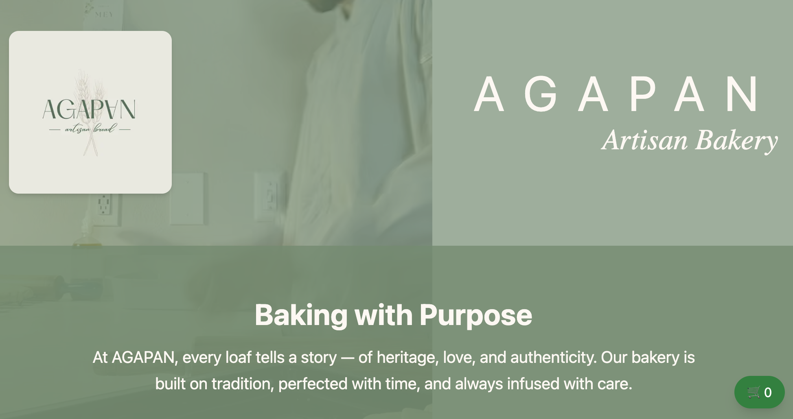
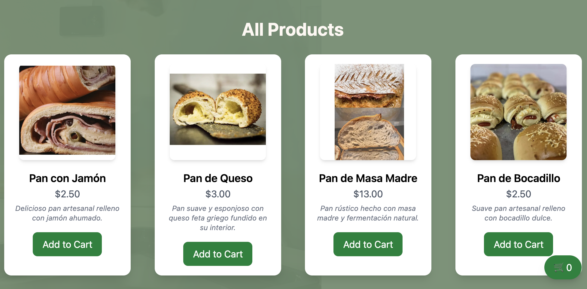
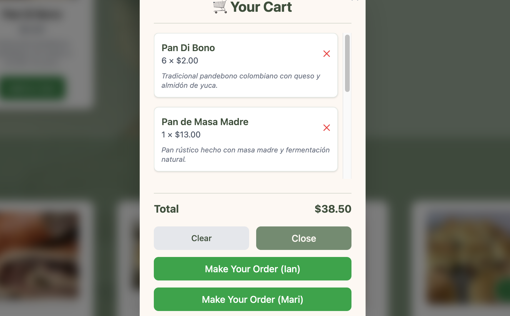

# 🥖 AGAPAN Artisan Bakery  

AGAPAN is a personal bakery website I built to showcase my artisan bread products and also use for my real bakery business.  
This project is part of my learning path as a Full-Stack Developer and is directly connected to my daily life.  

---

## 🚀 Tech Stack
- **Next.js 15** – Modern React framework  
- **TailwindCSS** – Utility-first styling  
- **TypeScript** – Type safety  
- **Prisma** – ORM for database (future use)  

---

## 📷 Screenshots
  
  
  

---

## 📌 Features
- 🎥 Background video hero section  
- 🥯 Product listing with images and descriptions  
- 🛒 Shopping cart modal  
- 📱 WhatsApp order integration (for real customer use)  
- 🌐 Fully deployed on [Vercel](https://agapan-website.vercel.app)  

---

## 📖 Daily Usage
This website is used to share my bakery’s products, receive WhatsApp orders,  
and connect directly with my social networks. It’s both a portfolio project  
and a working tool for my artisan bakery.  

---

## 📌 Future Improvements
- 💳 Online payments with Stripe  
- 📊 Admin dashboard for managing orders  
- 🗄️ Database integration (Prisma + PostgreSQL)  
- 📢 Automatic notifications via WhatsApp/Email  

---

## 👨‍💻 Author
**Ian Mey**  
💼 Full-Stack Developer (in progress)  
📍 Jacksonville, Florida  
📧 meyian_777@outlook.com  
📧 meymcian@gmail.com  

---